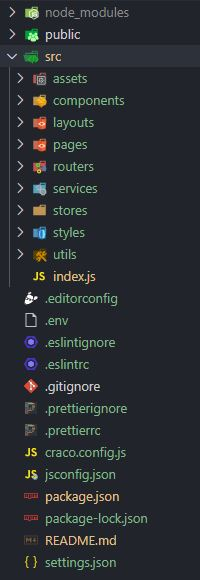

## Introduce
This is a template for ReactJS applications, was bootstrapped with [Create React App](https://github.com/facebook/create-react-app).
It includes:
  * Routing: [React Router Dom](https://reactrouter.com/web/guides/quick-start)
  * State management: [Mobx](https://mobx.js.org) and [Mobx-react](https://mobx-react.js.org/)
  * API control: [Axios](https://github.com/axios/axios)
  * UI components: [Ant Design](https://ant.design/)
  * Locale provider: [i18next](https://www.i18next.com/) and [react-i18next](https://react.i18next.com/)
  * Customize CRA: [Craco](https://github.com/gsoft-inc/craco)
  * Code convention: [ESlint](https://eslint.org/)
  * Format convention: [Prettier](https://prettier.io/)
  * Pre-commit: [Husky](https://github.com/typicode/husky)

## Requirements
  - [Nodejs](https://nodejs.org/en/)
  - [npx cli](https://www.npmjs.com/package/npx)

## Install
  1. Open folder where you want to install in command line
  2. `npx create-react-app project-name --template "@trantuantphp/cra-template-javascript-mobx"`
  3. `cd project-name`
  4. Copy all files in ***settings***  folder to ***root***  folder
  5. Copy all **key** and **value** in ***package.dev.json***  to ***package.json***
  6. `npm install`

## Folder Structure
After install successfully, you will get a project folder with structure:
 

  
  

    <ul style="">
      <li>
        <i><b>assets</b></i>: images and locales
      </li>
      <li>
        <i><b>components</b></i>: common components
      </li>
       <li>
        <i><b>layouts</b></i>: layouts of app
      </li>
      <li>
        <i><b>pages</b></i>: all pages of app
      </li>
      <li>
        <i><b>routers</b></i>: routes with react-router-dom
      </li>
      <li>
        <i><b>services</b></i>: configure for call api
      </li>
      <li>
        <i><b>stores</b></i>: store and configure of Mobx
      </li>
      <li>
        <i><b>styles</b></i>: common style by scss
      </li>
      <li>
        <i><b>utils</b></i>: common utilities
      </li>
    </ul>
  

 
